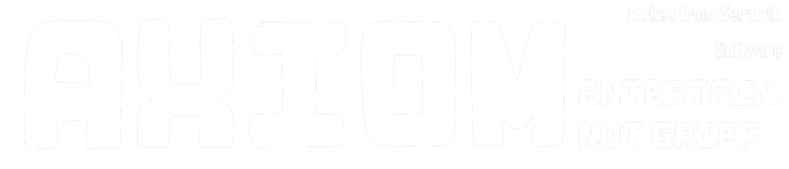

  

---

# Axiom Menu  
Forked from Seralyth Menu

**Axiom Menu** is a Mod Menu designed to try and **Entertain** the Monke of Gorilla Tag. It is a menu for those like me who want to hear people laugh instead of tormenting those without such ability. This menu is **NOT** to be used for advantages or to harrass or annoy players. See the **Terms Of Use** in our [Discord Server](https://discord.gg/gNqNT7upCh) for more information.

  
<b>❔ What did you change?</b>

	
Good question. First thing I did was remove [Console](https://github.com/Seralyth/Console) to prevent any interference with Seralyth Console Admins. One main thing I changed was removing the following Categories:
> - Advantages
> - Overpowered
> - Experimental
> - Detected Mods

I had also removed all Crash, Strobe, Flash, Lag, Kick and Annoy mods from the menu too.

Okay... But what did you Add?

Currently I Added a **Mute** button and a **Report Category** to the Selected Player Tab to make reporting and muting Bad Gorilla's quicker and easier. I intend to add more features in the future.

  
<b>💾 Installation</b>

	
1. **Download** the latest release **[here](https://github.com/Axiom-Menu/Axiom/releases/latest)**
2. **Drag & Drop** `Seralyth-Menu.dll` into your plugins folder  
3. **Launch** Gorilla Tag and enjoy!

**🧱 From Source Code (for developers!)**

1. Download the source code for Seralyth **[here](https://github.com/Seralyth/Seralyth-Menu/releases/latest)**
2. Edit `Directory.Build.props` and update `<GamePath>` if your Gorilla Tag is in a custom spot
3. Build the project with `Ctrl + Shift + B` 
✅ The DLL will automatically go into your Gorilla Tag plugins folder

---

  
<b>🎛️ System Compatibility</b>

	
| Operating System | Menu | Fonts | Images | Sounds | Videos |
|------------------|------|--------|--------|--------|--------|
| Windows 10|✅|✅|✅|✅|✅|
| Windows 11|✅|✅|✅|✅|✅|
| Mac OS|✅|✅|✅|✅|❌|
| Linux|✅|✅|✅|✅|❌|

> ✅ Works as intended ; ⚠️ Semi functional ; ❌ Does not work ; ❓ Untested

  
<b>🔗 Headset Compatibility</b>

	
| Headset | Menu | Mods |
|---------|------|------|
|Rift|✅|✅|
|Rift S|✅|✅|
|Oculus Go|⚠️|❌|
|Quest 1|✅|✅|
|Quest 2|✅|✅|
|Quest Pro|✅|✅|
|Quest 3/3s|✅|✅|
|Pico 4/Pro|✅|✅|
|Pico 4 Ultra Pro|✅|⚠️|
|Valve Index|✅|✅|
|HTC VIVE/Pro|✅|⚠️|
|HP Reverb G1/G2|✅|⚠️|

> ✅ Fully functional ; ⚠️ Limited functionality ; ❌ Not functionable ; ❓ Untested

  
<b>🗣️ Contact Information</b>

	
Join our [Discord](https://discord.gg/gNqNT7upCh)!

> [!NOTE] 
> This product is not affiliated with Gorilla Tag or Another Axiom LLC and is not endorsed or otherwise sponsored by Another Axiom LLC. Portions of the materials contained herein are property of Another Axiom LLC. © 2026 Another Axiom LLC. 
> Menu sends requests to https://text.pollinations.ai for the mod **AI Assistant**. (when enabled) 
> Menu sends requests to https://lazypy.ro for many TTS voices. 
> Menu connects to wss://menu.seralyth.software for friend system and administrative purposes. 
> The donate, search, star and speak symbols are provided from [Icons8](https://icons8.com).

> Seralyth Menu  README.md 
> A community driven mod menu for Gorilla Tag with over 1000+ mods
>
> Copyright (C) 2026  Seralyth Software
> https://github.com/Seralyth/Seralyth-Menu
> 
> This program is free software: you can redistribute it and/or modify
> it under the terms of the GNU General Public License as published by
> the Free Software Foundation, either version 3 of the License, or
> (at your option) any later version.
> 
> This program is distributed in the hope that it will be useful,
> but WITHOUT ANY WARRANTY; without even the implied warranty of
> MERCHANTABILITY or FITNESS FOR A PARTICULAR PURPOSE.  See the
> GNU General Public License for more details.
> 
> You should have received a copy of the GNU General Public License
> along with this program.  If not, see <https://www.gnu.org/licenses>.

> This product is not affiliated with Another Axiom Inc. or its videogames Gorilla Tag and Orion Drift and is not endorsed or otherwise sponsored by Another Axiom. Portions of the materials contained herein are property of Another Axiom. ©2021 Another Axiom Inc.

> The names "Seralyth", "Seralyth Software", logos, artwork, and branding are not covered by this license.
